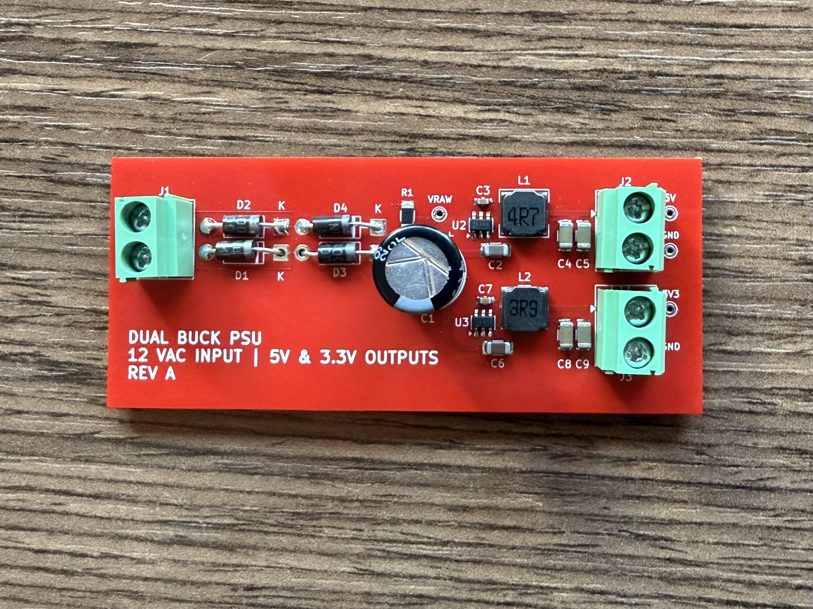
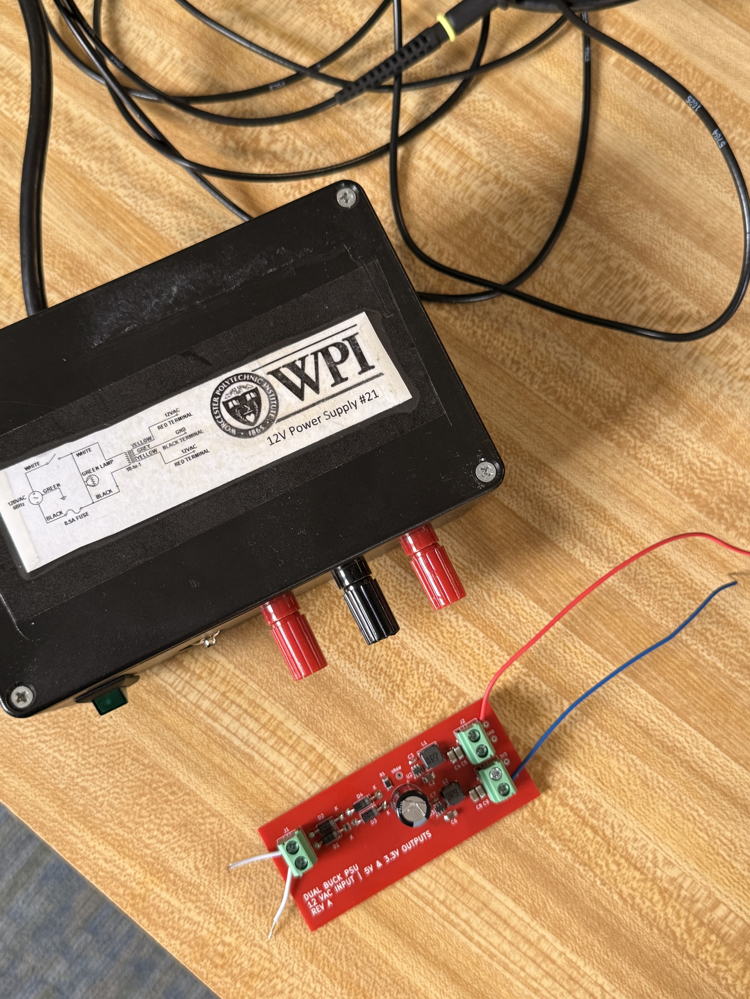
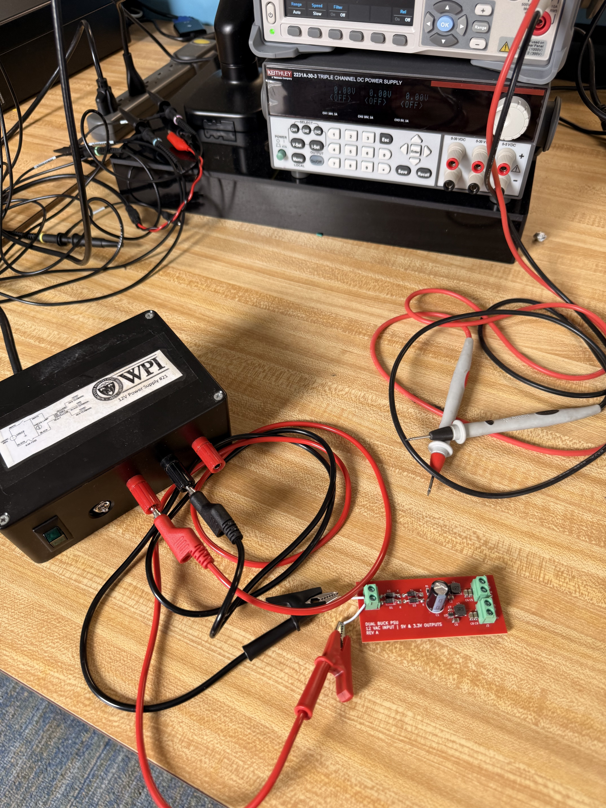
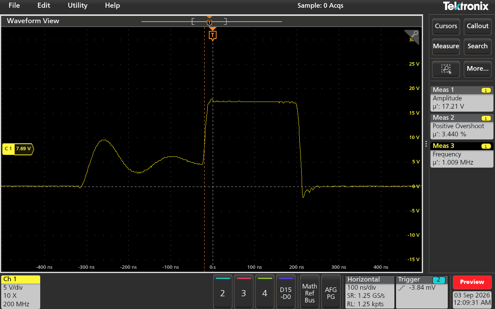
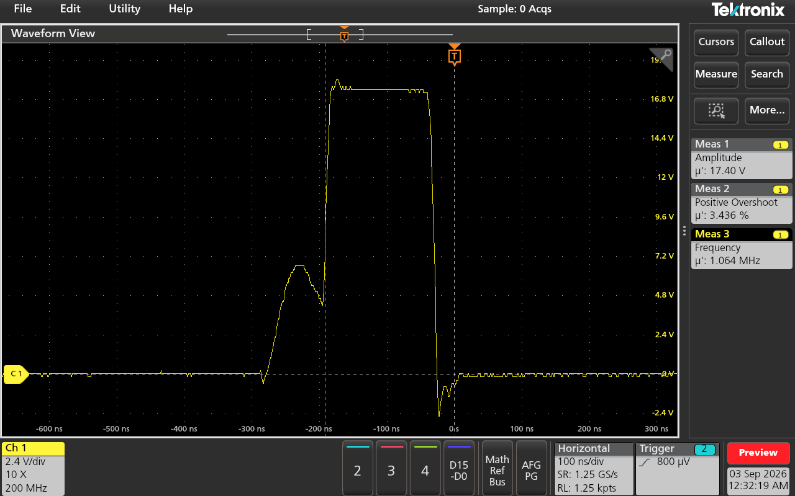
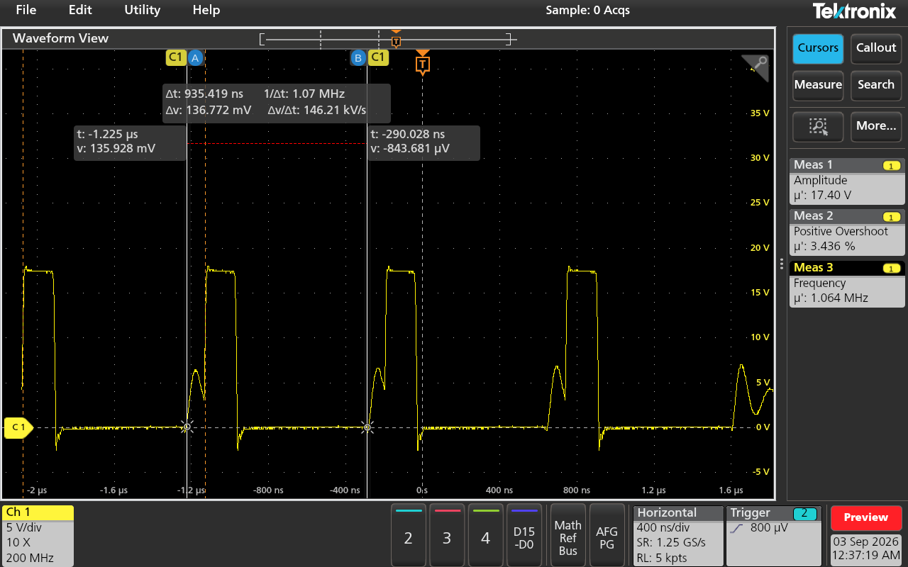
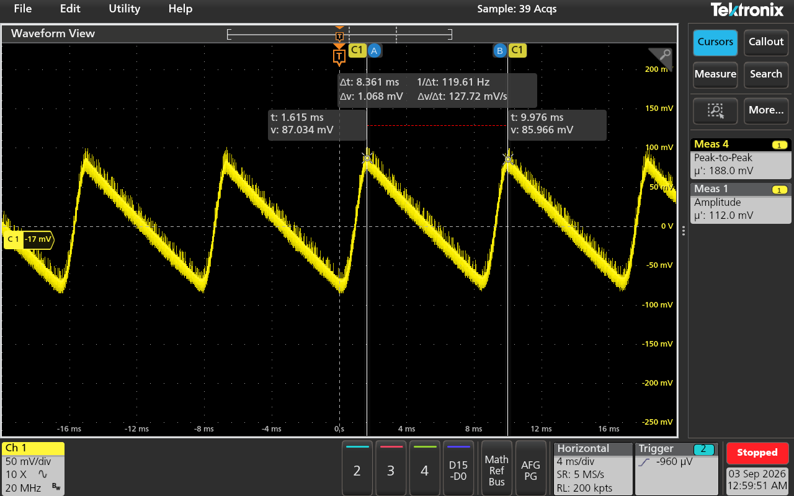
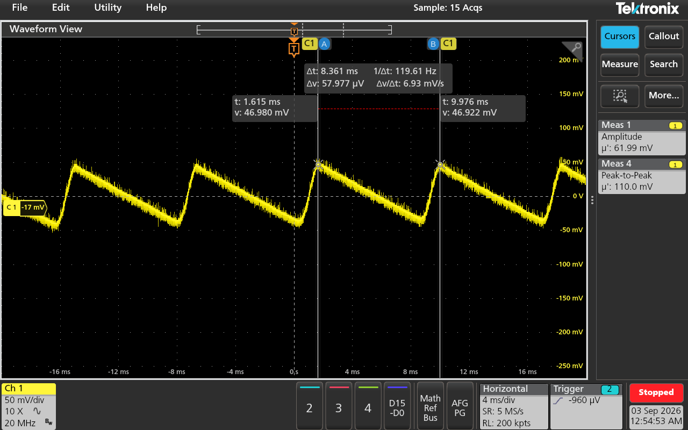
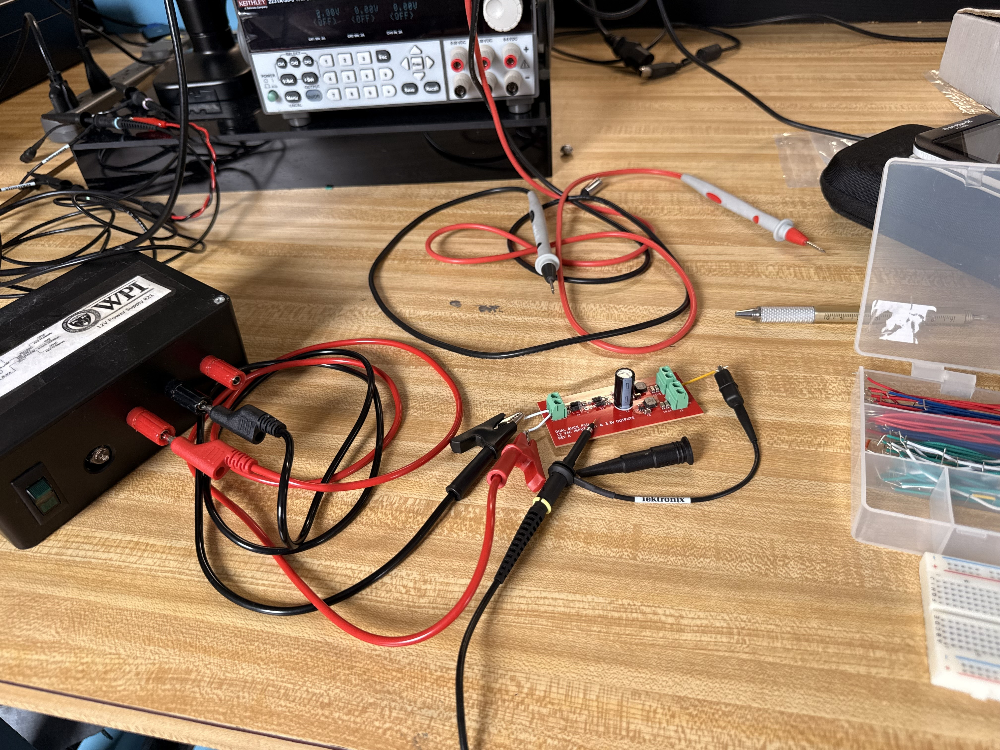

# 12VAC Dual-Output Buck Power Supply PCB

**Status:** Fabricated / Bench-Validated (Rev A)
**Input:** 12 VAC RMS, 60 Hz
**Outputs:** Fixed 5 V and 3.3 V rails
**PCB:** 2-layer, 80.15 mm × 34.20 mm, 1.6 mm FR-4
**Copper:** 35 µm top / 35 µm bottom
**Revision:** Rev A
**Design tools:** KiCad 9 and LTspice
**Test equipment:** Tektronix oscilloscope, Keithley 2231A-30-3 bench supply, DMM, isolated 12 VAC transformer supply



## Overview

This project is a compact AC-to-DC power supply PCB that accepts **12 VAC** and produces two regulated DC outputs: **5 V** and **3.3 V**.

In simple terms, the board performs three jobs:

1. **Converts AC into DC** using a four-diode bridge rectifier.
2. **Smooths the rectified voltage** using a large bulk capacitor.
3. **Efficiently steps the DC voltage down** into separate 5 V and 3.3 V rails using two buck converters.

The project began with a linear-regulator architecture, but thermal calculations showed that too much power would be lost as heat. I redesigned the supply around two switching regulators and carried the design through schematic capture, component selection, footprint verification, PCB layout, routing, BOM preparation, and assembly-position-file generation.

The board has since been **fabricated, assembled, and bench-validated**. Measured switch-node behavior, output accuracy, and VRAW ripple are documented in [Bench Bring-Up & Validation](#bench-bring-up--validation) below, and a few specific layout refinements identified during that process are documented in [Known Layout Considerations](#known-layout-considerations-informing-rev-b).

> **Input note:** This PCB is intended for a low-voltage 12 VAC source. It is not designed to connect directly to wall mains.

---

## Design Decision

### Original Linear-Regulator Approach

The first version used an **LM7805** to generate 5 V, followed by a second linear regulator for the 3.3 V rail.

LTspice rectifier simulation placed the filtered raw DC bus near **15.6 V**. At a 5 V, 1 A operating point, the LM7805 alone would dissipate:

```text
PLOSS = (VIN - VOUT) × IOUT

PLOSS = (15.6 V - 5 V) × 1 A
PLOSS = 10.6 W
```

A linear regulator removes excess voltage by turning it into heat. In this case, the regulator would be dissipating more than 10 W while only delivering 5 W to the load.

That made the linear architecture a poor fit for the size and thermal goals of the board.

### Buck-Converter Redesign

The supply was rebuilt around two fixed-output synchronous buck converters connected in parallel to the rectified DC bus:

- **U2 — AP63205WU-7:** fixed 5 V buck converter
- **U3 — AP63203WU-7:** fixed 3.3 V buck converter

A buck converter uses high-frequency switching, an inductor, and capacitors to transfer energy efficiently instead of continuously burning the voltage difference as heat.

The two output stages are **not cascaded**. Both converters receive power directly from `V_Raw`, so the 3.3 V rail does not depend on the 5 V regulator operating first.

---

## Final Architecture

```text
                         12 VAC INPUT
                              │
                              ▼
                 D1-D4: 1N4004 Bridge Rectifier
                              │
                              ▼
                 C1: 1000 µF Bulk Capacitor
                 R1: 10 kΩ Bleeder Resistor
                              │
                              ▼
                         V_RAW DC BUS
                              │
                 ┌────────────┴────────────┐
                 │                         │
                 ▼                         ▼
        5 V BUCK CONVERTER        3.3 V BUCK CONVERTER
            AP63205WU                 AP63203WU
                 │                         │
         C2: 10 µF input            C6: 10 µF input
         C3: 100 nF BST             C7: 100 nF BST
         L1: 4.7 µH                 L2: 3.9 µH
         C4/C5: 2 × 22 µF           C8/C9: 2 × 22 µF
                 │                         │
                 ▼                         ▼
           J2: 5 V / GND              J3: 3.3 V / GND
                 │                         │
             5 V test pad              3V3 test pad
```

Additional test access is provided for **VRAW** and **GND**.

---

## How the Circuit Works

### 1. AC Input and Full-Wave Rectification

`J1` accepts the 12 VAC input.

The four **1N4004** diodes (`D1-D4`) form a full-wave bridge rectifier. During each half-cycle of the AC waveform, a different pair of diodes conducts so that current through the DC side of the circuit always flows in the same direction.

For a 12 VAC RMS source, the unloaded sine-wave peak is approximately:

```text
VPEAK = VRMS × √2
VPEAK = 12 V × √2
VPEAK ≈ 16.97 V
```

The bridge introduces diode losses, so the usable rectified voltage is lower than the ideal peak. The LTspice work for this design produced a filtered raw bus near **15.6 V**.

Because both halves of the 60 Hz input waveform are used, the rectified ripple occurs at approximately **120 Hz**.

### 2. Bulk Filtering and VRAW

`C1` is a **1000 µF electrolytic capacitor** placed across the rectified output.

The bridge charges C1 near the peaks of the AC waveform. Between peaks, C1 supplies energy to the load and helps keep `V_Raw` from falling immediately back toward zero.

A first-order capacitor-ripple relationship is:

```text
ΔV ≈ ILOAD / (FRIPPLE × C)
```

where:

- `ΔV` is the approximate peak-to-peak bus ripple,
- `ILOAD` is the load current drawn from the rectified bus,
- `FRIPPLE` is approximately 120 Hz for 60 Hz full-wave rectification,
- `C` is the bulk capacitance.

This relationship is checked against measured VRAW ripple in [Bench Bring-Up & Validation](#bench-bring-up--validation) below.

`R1`, a **10 kΩ bleeder resistor**, provides a discharge path for the bulk capacitor after input power is removed. At approximately 15.6 V, it draws about **1.6 mA**, and the nominal `R × C` time constant is approximately **10 seconds**.

### 3. 5 V Buck Stage

The upper regulator stage uses `U2`, an **AP63205WU-7**, to generate the fixed 5 V rail.

Its external power-stage components are:

- `C2` — 10 µF local input capacitor
- `C3` — 100 nF bootstrap capacitor
- `L1` — 4.7 µH **TYS60284R7N-10**
- `C4`, `C5` — two 22 µF output capacitors

The switching node drives L1, and the inductor/output-capacitor network filters the switched waveform into a regulated DC output.

The finished 5 V rail is available at:

- `J2`
- the dedicated **5V** test pad

### 4. 3.3 V Buck Stage

The lower stage follows the same architecture using `U3`, an **AP63203WU-7**, for the fixed 3.3 V rail.

Its external components are:

- `C6` — 10 µF local input capacitor
- `C7` — 100 nF bootstrap capacitor
- `L2` — 3.9 µH **ASPI-0628-3R9M-T1**
- `C8`, `C9` — two 22 µF output capacitors

The finished 3.3 V rail is available at:

- `J3`
- the dedicated **3V3** test pad

---

## PCB Implementation

The final layout is a **2-layer board** measuring **80.15 mm × 34.20 mm**.


### Layer Stack

```text
Top Silkscreen
Top Solder Mask
35 µm F.Cu
1.51 mm FR-4 core
35 µm B.Cu
Bottom Solder Mask
Bottom Silkscreen
```

The complete PCB thickness is configured as **1.6 mm**.

### Layout Strategy

The board is organized left-to-right by power flow:

```text
12 VAC Input
    →
Bridge Rectifier
    →
Bulk Filtering / VRAW
    →
Parallel 5 V and 3.3 V Buck Stages
    →
Output Connectors
```

This physical organization makes the circuit easier to follow visually and keeps the functional blocks separated.

Other layout decisions include:

- **All populated assembly components are on the top side.**
- A **GND copper zone covers the bottom copper layer** to provide a low-impedance ground return.
- Wider traces are used on the main power paths, with routed widths reaching **1.25 mm** on portions of `V_Raw`.
- The regulated output routing uses wider sections up to approximately **0.75-1.0 mm**.
- Smaller **0.20 mm** traces are used for lower-current local and feedback connections; the SW-node traces on both buck stages also measure 0.20 mm despite carrying switching currents up to 2 A — see [Known Layout Considerations](#known-layout-considerations-informing-rev-b) below.
- The board includes plated test pads for `VRAW`, `5V`, `3V3`, and `GND`.
- The test pads are excluded from pick-and-place output because no separate test-point component needs to be assembled.
- `L1` uses a custom footprint matched to the **TYS60284R7N-10** land pattern.
- `L2` uses the custom **IND_ASPI-0628-3R9M-T1** footprint.
- Front silkscreen labels identify the input, both outputs, ground points, `VRAW`, and **REV A**.

---

## Known Layout Considerations (Informing Rev B)

Reviewing the Rev A layout alongside the bench data below surfaced a few specific, targeted refinements for a Rev B revision. None of these are functional failures — the core topology and net connectivity are correct, and the bench results confirm the board works as designed — but they're worth documenting honestly rather than glossing over:

- **Input hot-loop area.** The loop formed by the buck-converter input capacitors (`C2`/`C6`) and their return path is larger than ideal, on the order of a 10 mm perimeter. A tighter loop reduces high-frequency loop inductance and ringing energy at the switch node.
- **Switch-node trace width.** The SW-node traces on both stages are routed at 0.20 mm despite carrying up to 2 A of peak switching current. Rev B will widen these traces to reduce resistive and inductive losses at the switch node.
- **Feedback trace routing.** At least one stage's feedback trace runs on the back copper layer, crossing beneath the output inductor and cutting into the bottom-layer ground plane in that area. Rev B will reroute feedback away from switching components and off a solid ground reference, per standard layout practice.
- **Practical current ceiling.** Independent of the layout items above, the realistic continuous load ceiling for this board is closer to **0.75–1 A per rail**, rather than the AP63205WU-7 / AP63203WU-7's full 2 A device rating. The limiting factors are the average-current rating of the `D1-D4` 1N4004 bridge diodes under capacitor-input-filter peak-current dynamics, and the ripple-current rating of the `C1` bulk capacitor — not the buck ICs themselves.

The bench data below was collected at a deliberately light 100 Ω resistive load (roughly 50 mA on the 5 V rail, 33 mA on the 3.3 V rail) to validate basic function, switching behavior, and output accuracy first. Load-regulation and thermal testing that approach the 0.75–1 A practical ceiling are still pending — see [Current Validation Status](#current-validation-status).

---

## Test and Debug Access

Four dedicated plated test pads are included:

| Test pad | Purpose |
|---|---|
| `VRAW` | Measure the rectified and bulk-filtered DC bus |
| `5V` | Measure the regulated 5 V output |
| `3V3` | Measure the regulated 3.3 V output |
| `GND` | Oscilloscope / multimeter ground reference |

These pads are intended to make bring-up easier with a multimeter or oscilloscope without requiring probes to contact the small regulator pins directly.

---

## Bill of Materials

The current assembly BOM contains **11 unique line items and 21 populated components**:

- **13 SMD components**
- **8 through-hole components**
- **4 additional bare test-point pads** on the PCB

| Ref. | Qty. | Value / Function | Actual Part Number | Vendor Part # | Footprint |
|---|---:|---|---|---|---|
| C1 | 1 | 1000 µF bulk capacitor | `35PK1000MEFC10X20` | `C1580768` | `CP_Radial_D10.0mm_P5.00mm` |
| C2, C6 | 2 | 10 µF buck input capacitors | `CGA1206X5R106K350NT` | `C6119957` | `C_1206_3216Metric` |
| C3, C7 | 2 | 100 nF bootstrap capacitors | `C0603C104K5RACTU` | `C127833` | `C_0603_1608Metric` |
| C4, C5, C8, C9 | 4 | 22 µF output capacitors | `TMK316BBJ226ML-T` | `C386093` | `C_1206_3216Metric` |
| D1-D4 | 4 | 1N4004 bridge-rectifier diodes | `1N4004` | `C3058` | `D_DO-41_SOD81_P10.16mm_Horizontal` |
| J1-J3 | 3 | 2-position 5.0 mm terminal blocks | `MX126-5.0-02P-GN01-Cu-S-A` | `C5188434` | `TerminalBlock_MaiXu_MX126-5.0-02P_1x02_P5.00mm` |
| L1 | 1 | 4.7 µH 5 V buck inductor | `TYS60284R7N-10` | `C2454435` | `L_6.0x6.0_Pad1.8x5.7_Gap2.6` |
| L2 | 1 | 3.9 µH 3.3 V buck inductor | `ASPI-0628-3R9M-T1` | `C7325703` | `IND_ASPI-0628-3R9M-T1` |
| R1 | 1 | 10 kΩ VRAW bleeder resistor | `CRCW120610K0FKEA` | `C242483` | `R_1206_3216Metric` |
| U2 | 1 | Fixed 5 V synchronous buck | `AP63205WU-7` | `C2071056` | `TSOT-23-6` |
| U3 | 1 | Fixed 3.3 V synchronous buck | `AP63203WU-7` | `C780769` | `TSOT-23-6` |

The spreadsheet used for the current assembly quotation is included in the repository under `03_kicad`.

---

## KiCad / Manufacturing Files

The `03_kicad` directory contains the current source and assembly-support files:

```text
03_kicad/
├── screenshots/
├── psu_board.png
├── psu_bom(2026-08-06).xlsx
├── psu_main.kicad_pcb
├── psu_main.kicad_pro
├── psu_main.kicad_sch
├── psu_main-top.pos
└── psu_main-bottom.pos
```

Useful direct links:

- [KiCad schematic](03_kicad/psu_main.kicad_sch)
- [KiCad PCB layout](03_kicad/psu_main.kicad_pcb)
- [KiCad project file](03_kicad/psu_main.kicad_pro)
- [Assembly BOM](03_kicad/psu_bom%282026-08-06%29.xlsx)
- [Top-side component positions](03_kicad/psu_main-top.pos)
- [Bottom-side component positions](03_kicad/psu_main-bottom.pos)

The top-side position file contains all 21 populated BOM components. The bottom-side position file is intentionally empty because no assembly components are mounted on the bottom of the PCB.

---

## Bench Bring-Up & Validation

### Safe Power-Up Procedure

AC bring-up was staged deliberately rather than connecting a line-derived AC source straight to the board:

1. **Isolated source, not a variac.** Power was supplied through a WPI lab bench transformer unit (`12V Power Supply #21`). Per its own label, 120 VAC/60 Hz mains feeds a switched, 0.5 A-fused primary into a 10:1 step-down transformer with a center-tapped secondary (yellow–grey–yellow), broken out to two independent 12 VAC "hot" terminals referenced to a common "GND" center-tap terminal. Only one 12 VAC leg and the center-tap GND were used to feed the board's 2-pin AC input — a genuinely galvanically isolated 12 VAC source, consistent with the board's rating.
2. **Bench-supply pre-check.** Before applying AC, the board was brought up through the `V_Raw` test point using a Keithley 2231A-30-3 triple-output bench supply in current-limited mode, to confirm both buck stages started up and regulated correctly from a controlled DC source before introducing the rectifier and AC front end.
3. **Load and measure.** With AC applied, a 100 Ω, 1/4 W resistor was used as the load on one output rail at a time, and an oscilloscope and DMM were used to characterize `VRAW`, both switch nodes, and the regulated outputs.





### Output Voltage Accuracy

Both output rails were measured with a bench DMM within **0.7% of their nominal 5 V / 3.3 V targets**, comfortably inside the AP63205WU-7 / AP63203WU-7's **±2%** output voltage accuracy specification.

### Switch-Node Characterization

Probing the SW pin on each buck IC under the 100 Ω load condition:

| Rail | Buck IC | Switch-Node Amplitude | Positive Overshoot | Switching Frequency (measured) | Switching Frequency (datasheet typ.) |
|---|---|---:|---:|---:|---:|
| 5 V | AP63205WU-7 | 17.21 V | 3.440% | 1.009 MHz | 1.1 MHz |
| 3.3 V | AP63203WU-7 | 17.40 V | 3.436% | 1.064 MHz | 1.1 MHz |







Both rails show essentially identical positive overshoot (3.44%) despite being two independently populated converters, which points to consistent compensation and a clean switch-node layout on both stages. Measured switching frequency on both rails also lands close to the AP63205WU-7 / AP63203WU-7's 1.1 MHz typical switching frequency; the small spread between the two rails (1.009 MHz vs. 1.064 MHz) is consistent with the IC's built-in ±6% frequency spread-spectrum (FSS) jitter, which intentionally varies switching frequency for EMI suppression rather than indicating a fault or mismatch between the two stages.

### VRAW Ripple

| Load Condition | Approx. Output Current | VRAW Ripple (Amplitude) | VRAW Ripple (Pk-Pk) |
|---|---:|---:|---:|
| 100 Ω on 5 V rail | ~50 mA | 112.0 mV | 188.0 mV |
| 100 Ω on 3.3 V rail | ~33 mA | 61.99 mV | not captured |





The VRAW ripple relationship from [Bulk Filtering and VRAW](#2-bulk-filtering-and-vraw) (ΔV ≈ I_LOAD / (F_RIPPLE × C)) predicts this trend: pulling more current through the 5 V rail draws more current off the shared VRAW bus and should produce more bus ripple than the lighter 3.3 V-rail load — which is exactly what was measured.

As a rough back-of-envelope check — assuming ~85% conversion efficiency and V_RAW ≈ 16 V under light load — the formula predicts roughly **150 mV** of ripple for the 5 V-loaded case and roughly **65 mV** for the 3.3 V-loaded case. Both are in the same range as the measured 188 mV (pk-pk) and 62 mV (amplitude) respectively. The simple model doesn't account for `C1`'s ESR or capacitance tolerance, so this is order-of-magnitude agreement rather than an exact match — but it's a reasonable confirmation that the bulk-filtering behavior matches the design intent.

---

## Test and Bring-Up Assets

Oscilloscope captures and bring-up photos referenced above are collected under `04_bring_up/`:

```text
04_bring_up/
├── board-assembled-top.jpg
├── bench-setup-overview.jpg
├── probe-placement-swnode.jpg
├── isolation-transformer-label.jpg
├── sw-node-5v-overshoot.png
├── sw-node-3v3-overshoot.png
├── sw-node-3v3-multicycle.png
├── vraw-ripple-5v-load.png
└── vraw-ripple-3v3-load.png
```



---

## Current Validation Status

### Completed

- Initial linear-regulator thermal analysis
- LTspice bridge-rectifier / bulk-filter simulation
- Buck-converter architecture redesign
- Component selection
- Schematic capture
- Footprint assignment and verification
- Custom inductor footprint integration
- 2-layer PCB placement and routing
- Bottom-layer GND plane
- Input / output / VRAW test access
- BOM generation and assembly part matching
- Top and bottom component-position-file generation
- Fabrication package review
- Board fabrication and assembly
- Safe, staged AC bring-up (isolated transformer + current-limited bench-supply pre-check)
- `VRAW` DC level and ripple measurement under light load
- 5 V and 3.3 V output-voltage verification (within 0.7% of nominal)
- Switch-node characterization on both buck stages (overshoot, switching frequency)

### Pending

- Load-regulation testing across a wider current range, approaching the ~0.75–1 A practical per-rail ceiling
- Regulator and inductor thermal checks under load
- Full efficiency curve across the load range
- Rev B layout revision addressing the input hot loop, switch-node trace width, and feedback routing (see [Known Layout Considerations](#known-layout-considerations-informing-rev-b))

---

## Project Goal

The goal of this project was not only to create two DC rails, but to work through the complete hardware-design process:

```text
Requirements
    →
Architecture Selection
    →
Calculation / Simulation
    →
Component Selection
    →
Schematic Capture
    →
Footprint Verification
    →
PCB Layout and Routing
    →
Manufacturing Documentation
    →
Fabrication
    →
Bench Validation
```

The largest design change came from recognizing that the original linear-regulator architecture created an unacceptable thermal problem and then redesigning the system around switching regulators before committing the PCB to fabrication. Bench validation on Rev A confirmed that decision and the resulting layout are functionally sound, while also surfacing specific, targeted improvements — documented above — to carry into a Rev B iteration.
